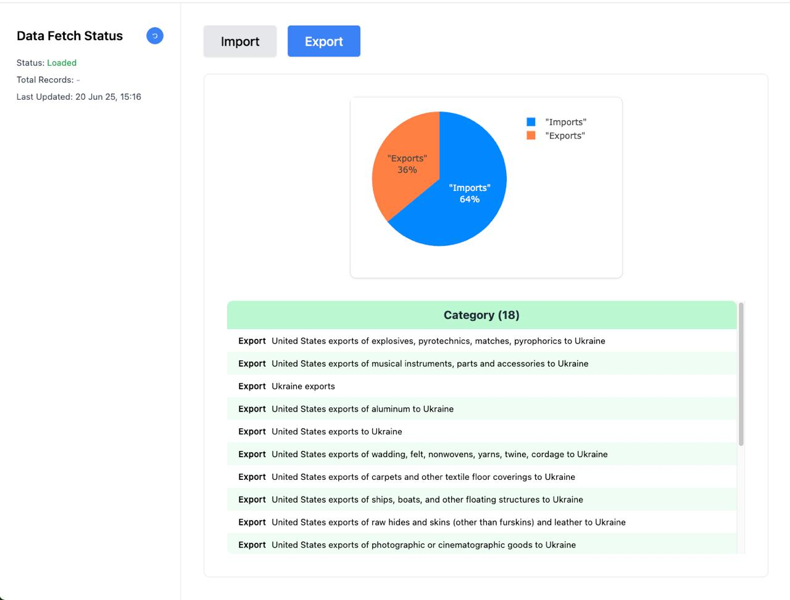

## Polars Economic Data Dashboard

A modern, minimal single-page application (SPA) for visualizing economic and market data using a Rust/Polars backend. Built with React 19, TypeScript, Tailwind CSS, Plotly, RxJS, and Webpack 5.

---

### Features
- Sidebar with live data fetch status and refresh
- Import/Export tabs with table and pie chart
- Responsive, scrollable table area (no page scroll)
- Modern UI with Tailwind CSS
- TypeScript, ESLint 9+, Prettier

---



---

### Getting Started

#### 1. Install dependencies
```sh
npm install
```

#### 2. Start the development server
```sh
npm start
```

- The app will open at [http://localhost:8080](http://localhost:8080)
- The backend API should be running at `http://localhost:3002`

#### 3. Lint and format
```sh
npm run lint    # ESLint 9+ (flat config)
npm run format # Prettier
```

---

### Tech Stack
- **React 19** + **TypeScript**
- **Tailwind CSS** for styling
- **Plotly.js** via `react-plotly.js` for charts
- **RxJS** for API state management
- **Webpack 5** for bundling
- **ESLint 9+** (flat config)

---

### Folder Structure
```
spa/
  src/
    App.tsx         # Main SPA component
    services/api.ts # RxJS API service
    ...
  public/
    index.html
  package.json
  tailwind.config.js
  eslint.config.js
  ...
```

---

### Notes
- The SPA expects the backend API to be available at `/api/*` endpoints.
- All data is served from the backend's in-memory Polars DataFrame.
- The table area is scrollable; the page itself does not scroll.

---

### License
MIT 